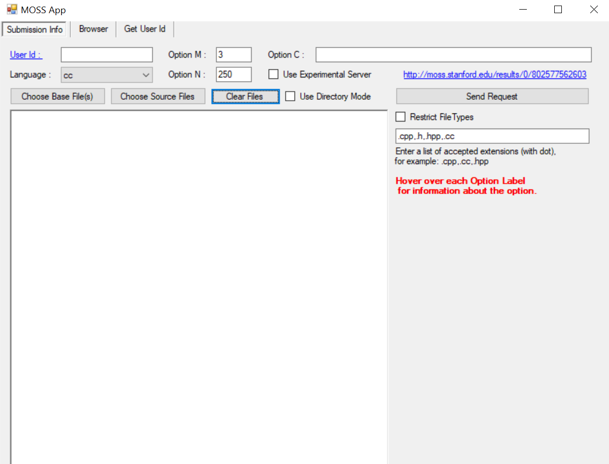
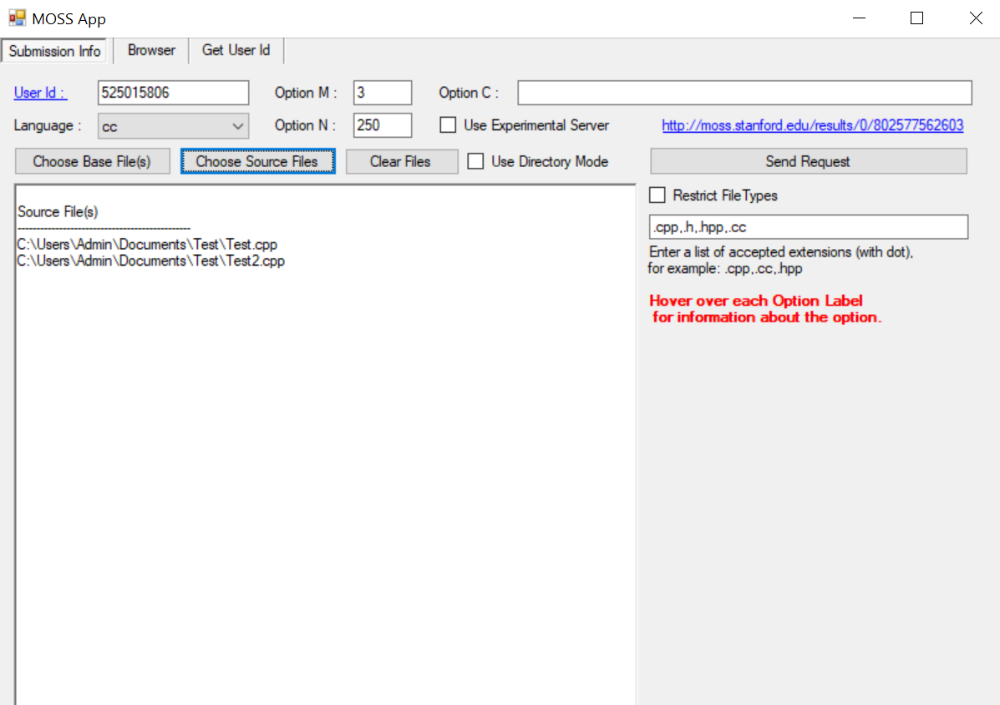

# moss-plagiarism-detection

A repo to help those who don't know how to implement the Moss app of Stanford

## How to run:

#### Step 1. Run the MossApp/Publish/setup.exe file:

(If the file throws errors, go to https://github.com/shanemay/MossApp, clone the repo to your machine, cd to MossApp/MossApp
/Publish/ and extract the _Setup.zip_ file there, which means you're going to overwrite the default _MossApp.exe_ file)

Example image of the app: 

#### Step 2: Paste the userId to be able to connect to the Moss server:

My example Id is: **525015806**

If you want to create a personal Id for privacy purposes, you can also follow these steps:

_1. Click the Get User Id button, then enter your email address, and copy whatever word the app outputs below and copy everything in it_
_2. Send an email to moss@moss.stanford.edu (this is a bot email) with the contents you copied, and the server will reply your mail in a couple minutes, so please be patient_
_3. Find the userId number which is buried deep in the lines of the content of the mail (because it includes a long and cumbersome source code), and that should be what you want!_

####Step 3: Prepare the odds:
Create a folder and dump whatever amount of source code files you want to compare in it (e.g: 2 cpp files) and they should have the same extension format (the contrary also works, but no one would do that), then click _Choose Source Files_ and select the mentioned folder in your machine.
**Example:**

###### (Here I have a folder named Test and it has 2 cpp files named Test and Test2 in it. cc here means cpp files)

Then click the _Send Request_ button, and it will generate a link on top. Click it and you're all set!
